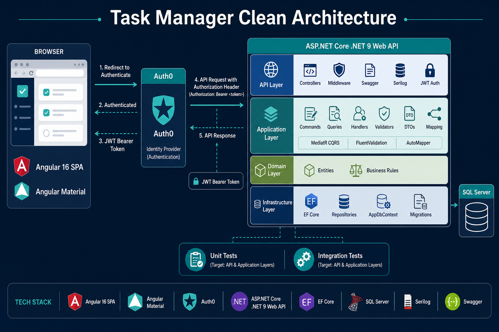

# Task Manager using Clean Architecture

## Overview

This project implements a **Task Management System** using **.NET Web API** and **Angular** SPA, following **Clean Architecture**, CQRS with MediatR, and SQL Server.

It supports user and task management, including advanced filtering and JSON data handling in SQL Server.

The solution also includes enterprise-grade authentication and authorization using **Auth0**, JWT Bearer tokens, Angular route protection, and secured ASP.NET Core API endpoints.

---

## Architecture

The following diagram summarizes the main runtime components, authentication flow, backend layers, database, tests, and primary technologies used by the solution.



### Solution structure

```text
src/backend/
 ├── TaskManagerCleanArchitecture.API
 ├── TaskManagerCleanArchitecture.Application
 ├── TaskManagerCleanArchitecture.Domain
 ├── TaskManagerCleanArchitecture.Infrastructure

src/frontend/
 ├── task-manager-angular

tests/
 ├── TaskManagerCleanArchitecture.Tests
```

### Layers - Backend

* **API** → Controllers, middleware, JWT authentication
* **Application** → Commands, Queries, Validators
* **Domain** → Entities, business rules
* **Infrastructure** → EF Core, repositories

---

## Authentication & Authorization

Authentication and authorization are implemented using **Auth0** and **JWT Bearer Tokens**.

### Frontend (Angular)

* Auth0 Angular SDK integration
* Automatic login redirection using AuthGuard
* JWT access token acquisition
* HTTP Interceptor for automatic Bearer token injection
* Protected Angular routes
* User profile display on the main toolbar

### Backend (.NET 9 API)

* JWT Bearer authentication
* Auth0 token validation
* Protected API endpoints using `[Authorize]`
* Swagger JWT authentication support
* Integration test authentication mocking

### Swagger Authentication

Swagger UI supports JWT Bearer authentication.

1. Authenticate in Angular application
2. Copy the generated access token
3. Open Swagger UI
4. Click `Authorize`
5. Paste JWT token

Swagger will automatically send:

```http
Authorization: Bearer {token}
```

---

## Getting Started

### Run the API

```bash
cd src/backend
dotnet run --project TaskManagerCleanArchitecture.API --launch-profile "https" --urls="https://localhost:44342"
```

Swagger available at:

```text
https://localhost:44342/swagger
```

---

## Database Setup

### Apply migrations

```bash
cd src/backend
dotnet ef database update --project TaskManagerCleanArchitecture.Infrastructure --startup-project TaskManagerCleanArchitecture.API
```

---

## API Endpoints

### Users

* POST /api/users
* GET /api/users

---

### Tasks

* POST /api/tasks
* GET /api/tasks
* PUT /api/tasks/{id}/status

---

### Filtering & Sorting

```http
GET /api/tasks?userId={guid}&status={status}&order=asc|desc
```

Supports:

* Filter by user
* Filter by status
* Sort by creation date

---

## Run Angular SPA

```bash
cd src/frontend/task-manager-angular
npm install
ng serve -o
```

---

## Angular Environment Configuration

Edit:

```text
src/frontend/task-manager-angular/src/environments/environment.ts
```

Example:

```ts
export const environment = {

  production: false,

  auth: {

    domain: 'YOUR_AUTH0_DOMAIN',

    clientId: 'YOUR_AUTH0_CLIENT_ID',

    audience: 'https://taskmanager-api'
  },

  apiUrl: 'https://localhost:44342/api'
};
```

---

## Auth0 Configuration

### Allowed Callback URLs

```text
http://localhost:4200
```

### Allowed Logout URLs

```text
http://localhost:4200
```

### Allowed Web Origins

```text
http://localhost:4200
```

### API Audience

```text
https://taskmanager-api
```

---

## Business Rules

* Task title is required
* Task must have an assigned user
* Task cannot transition directly from Pending → Done

---

## Validations

Implemented using FluentValidation:

* Input validation at application layer
* Domain invariants enforced in entities

---

## JSON Support in SQL Server

Tasks include an `AdditionalData` column (`NVARCHAR(MAX)`) to store JSON.

### Example JSON

```json
{
  "priority": "High",
  "estimatedDate": "2026-05-01",
  "tags": ["backend", "urgent"]
}
```

---

## JSON Validation (SQL)

```sql
ALTER TABLE Tasks  
ADD CONSTRAINT CK_Tasks_AdditionalData_IsJson  
CHECK (  
    AdditionalData IS NULL  
    OR AdditionalData = ''  
    OR ISJSON(AdditionalData) = 1  
);
```

---

## JSON Queries

### Get a JSON field

```sql
SELECT  
    Id,  
    Title,  
    JSON_VALUE(AdditionalData, '$.priority') AS Priority  
FROM Tasks;
```

---

### Filter by JSON value

```sql
SELECT *  
FROM Tasks  
WHERE JSON_VALUE(AdditionalData, '$.priority') = 'High';
```

---

### Extract JSON object

```sql
SELECT  
    JSON_QUERY(AdditionalData, '$.metadata') AS Metadata  
FROM Tasks;
```

---

### Work with arrays

```sql
SELECT *  
FROM Tasks  
CROSS APPLY OPENJSON(AdditionalData, '$.tags');
```

---

### Update JSON field

```sql
UPDATE Tasks  
SET AdditionalData = JSON_MODIFY(AdditionalData, '$.priority', 'Low')  
WHERE Id = 'YOUR_ID';
```

---

## Technical Highlights

* Clean Architecture
* CQRS with MediatR
* FluentValidation pipeline
* Global exception handling
* JWT Authentication with Auth0
* Angular AuthGuard protection
* Angular HTTP Interceptors
* Swagger JWT Authorization
* SQL Server JSON functions
* Integration testing with mocked authentication
